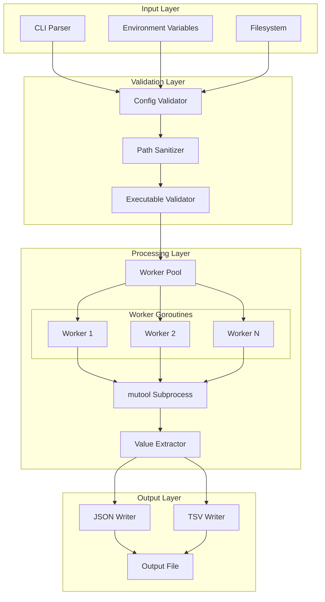
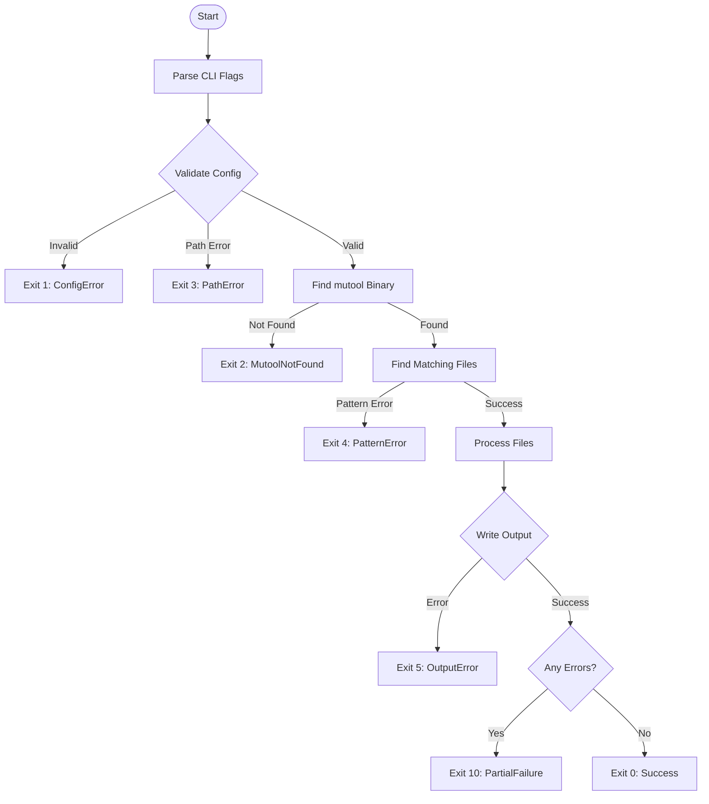
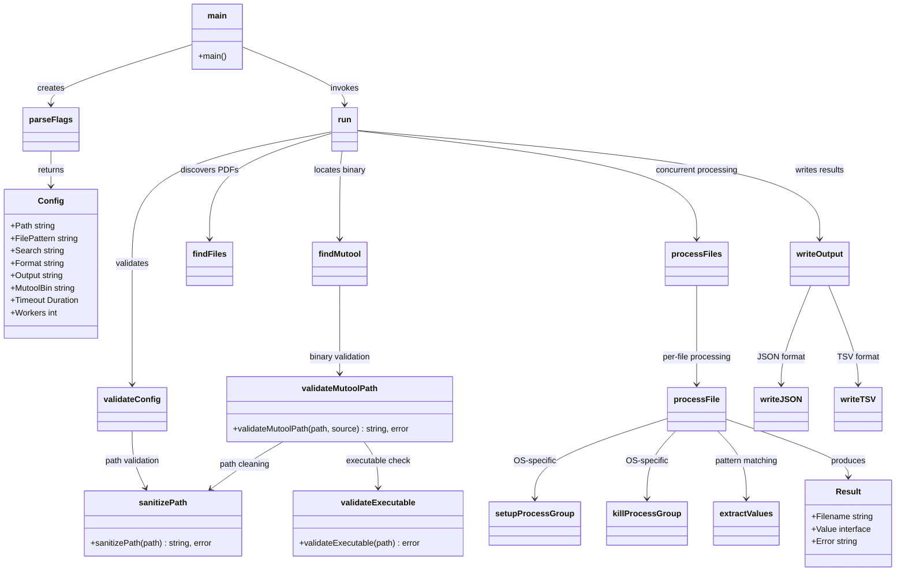
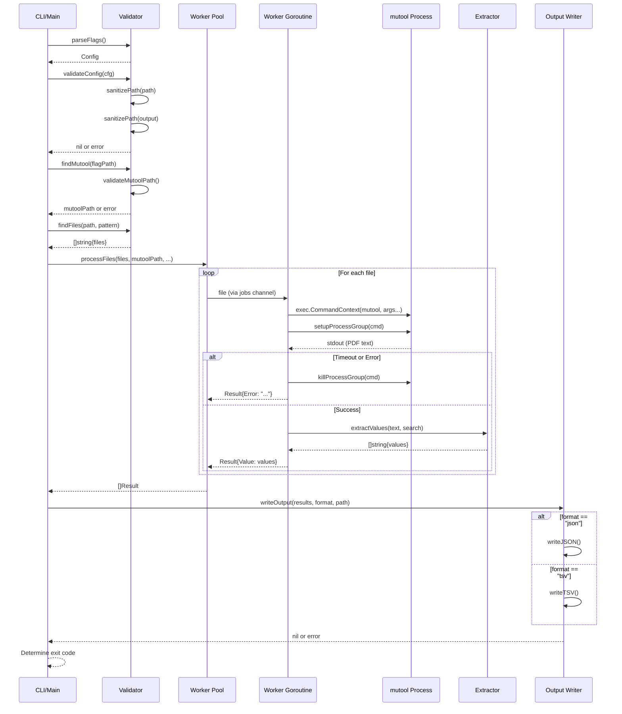
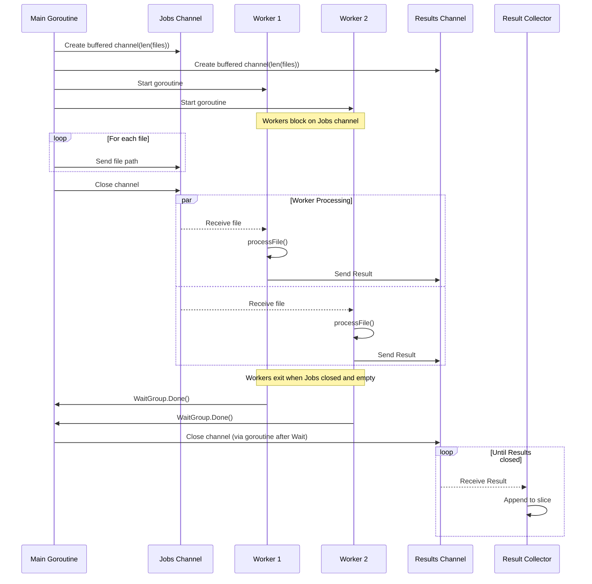
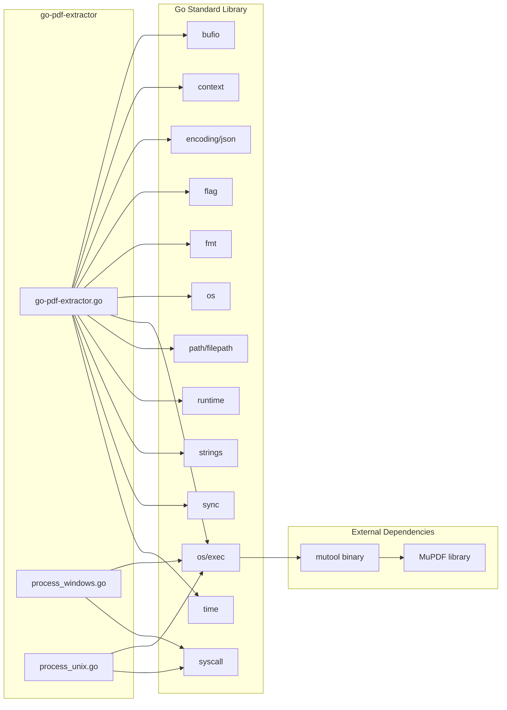

# go-pdf-extractor Architecture Document

## 1. Architecture and Design Choices

### 1.1 High-Level Architecture

The application follows a pipeline architecture with concurrent processing capabilities:

### 1.2 Design Decisions

#### 1.2.1 Worker Pool Pattern

**Decision**: Implement bounded worker pool using goroutines and channels.

**Rationale**:
- Predictable resource consumption with configurable concurrency limits
- Efficient utilization of multi-core systems for I/O-bound PDF processing
- Natural backpressure through buffered channels
- Clean shutdown semantics via channel closure

**Trade-offs**:
- Slight overhead from channel operations versus unbounded goroutines
- Fixed upper bound (16 workers) may underutilize high-core-count systems

#### 1.2.2 External Process for PDF Parsing

**Decision**: Use mutool as external subprocess rather than embedding a PDF library.

**Rationale**:
- MuPDF is a mature, well-tested PDF rendering library
- Avoids CGO complexity and cross-compilation issues
- Subprocess isolation provides fault tolerance (crashes do not affect main process)
- Simpler deployment (single binary plus mutool)

**Trade-offs**:
- Process spawn overhead per file
- Dependency on external binary availability
- Inter-process communication overhead

#### 1.2.3 NDJSON Output Format

**Decision**: Use newline-delimited JSON rather than JSON array.

**Rationale**:
- Streaming-friendly format for large result sets
- Each line is independently parseable
- Compatible with common log processing tools (jq, grep)
- Simpler error handling (partial output remains valid)

**Trade-offs**:
- Not valid JSON as a single document
- Requires line-by-line parsing by consumers

#### 1.2.4 Build Tags for Platform-Specific Code

**Decision**: Use Go build tags to separate Windows and Unix implementations.

**Rationale**:
- Process group handling differs fundamentally between platforms
- Clean separation without runtime conditionals
- Compiler excludes irrelevant code from each platform build

**Implementation**:
- `process_windows.go`: Uses `CREATE_NEW_PROCESS_GROUP` flag
- `process_unix.go`: Uses `Setpgid` and negative PID signals

### 1.3 Assumptions

| Assumption | Impact if Invalid |
|------------|-------------------|
| PDFs contain extractable text | No values extracted; null results returned |
| Search pattern appears on single line | Multi-line patterns not matched |
| mutool available and functional | Exit code 2 returned |
| Workspace directory is writable | N/A (only reads from workspace) |
| Output directory is writable | Exit code 5 returned |
| Filenames do not contain newlines | JSON output may be malformed |
| UTF-8 encoding in PDF text | Extraction may fail for other encodings |

### 1.4 Edge Cases

#### 1.4.1 Empty Workspace

**Scenario**: No files match the glob pattern.
**Behavior**: Empty output file created (empty JSON or TSV with header only).
**Exit Code**: 0 (Success)

#### 1.4.2 All Files Fail

**Scenario**: Every PDF fails processing (corrupt, password-protected, timeout).
**Behavior**: Output contains error entries for all files.
**Exit Code**: 10 (PartialFailure)

#### 1.4.3 Multiple Matches in Single File

**Scenario**: PDF contains search pattern multiple times.
**Behavior**: All unique values returned as array in JSON, comma-separated in TSV.
**Deduplication**: Identical values within same file are deduplicated.

#### 1.4.4 Very Large Files

**Scenario**: PDF processing exceeds timeout threshold.
**Behavior**: Process group killed, error recorded, other files continue.
**Mitigation**: Increase `-timeout` parameter for known large files.

#### 1.4.5 High File Count

**Scenario**: Thousands of files in workspace.
**Behavior**: Worker pool processes files concurrently within bounds.
**Memory**: Channels sized to file count; results accumulated in memory.
**Limitation**: Extremely large batches may exhaust memory.

### 1.5 Performance and Efficiency

#### 1.5.1 Concurrency Model Performance

| Factor | Impact |
|--------|--------|
| Worker count | Linear scaling up to I/O saturation |
| Channel buffering | Prevents goroutine blocking |
| Process spawn | ~10-50ms overhead per file |
| mutool execution | Dominant factor; varies with PDF size/complexity |

#### 1.5.2 Memory Characteristics

| Component | Memory Usage |
|-----------|--------------|
| Worker goroutines | ~8KB stack per worker |
| Job channel | Pointer size * file count |
| Result channel | Result struct size * file count |
| Result accumulation | All results held in memory |
| mutool output | Buffered per-file (released after extraction) |

#### 1.5.3 Recommended Worker Settings

| System Type | Recommended Workers |
|-------------|---------------------|
| 2-core system | 2-4 |
| 4-core system | 4-8 |
| 8+ core system | 8-16 |
| I/O-constrained (NFS, slow disk) | 2-4 |
| CPU-constrained | NumCPU |

## 2. Data Flow and Control Logic

### 2.1 Operational Flow

### 2.2 Code Relations

### 2.3 Data Sequence

### 2.4 Worker Pool Lifecycle

## 3. Dependencies

### 3.1 Go Standard Library Modules

| Package | Purpose |
|---------|---------|
| `bufio` | Buffered I/O for efficient file writing |
| `context` | Timeout and cancellation for subprocess management |
| `encoding/json` | JSON marshaling for output generation |
| `flag` | Command-line argument parsing |
| `fmt` | Formatted I/O and error messages |
| `os` | File operations, environment variables, process exit |
| `os/exec` | External process execution (mutool) |
| `path/filepath` | Cross-platform path manipulation and glob matching |
| `runtime` | CPU count detection for worker pool sizing |
| `strings` | String manipulation for value extraction |
| `sync` | WaitGroup for goroutine synchronization |
| `syscall` | Platform-specific process group operations |
| `time` | Duration parsing and timeout configuration |

### 3.2 External Utilities

| Utility | Version | Purpose | Installation |
|---------|---------|---------|--------------|
| mutool | 1.28.0+ | PDF text extraction | Part of MuPDF package |

### 3.3 Build Dependencies

| Tool | Version | Purpose |
|------|---------|---------|
| Go | 1.21+ | Compilation |
| Git | Any | Source control |

### 3.4 Development Dependencies

| Tool | Purpose |
|------|---------|
| golangci-lint | Static analysis and linting |
| gosec | Security vulnerability scanning |
| gofumpt | Code formatting |
| govulncheck | Dependency vulnerability checking |

### 3.5 Test Dependencies

| Resource | Purpose |
|----------|---------|
| mutool | Integration tests require functional mutool |
| testfiles/*.pdf | Sample PDF files for functional testing |

### 3.6 Dependency Graph

### 3.7 Runtime Environment Requirements

| Requirement | Specification |
|-------------|---------------|
| Operating System | Windows Server 2016+, Linux (kernel 3.10+) |
| Architecture | amd64 (x86_64), arm64 |
| Memory | Minimum 128MB, recommended 512MB+ for large batches |
| Disk | Read access to PDF workspace, write access to output directory |
| Permissions | Execute permission for mutool binary |
