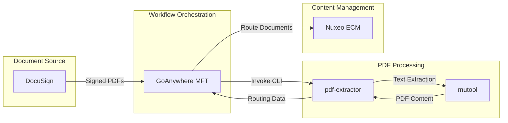
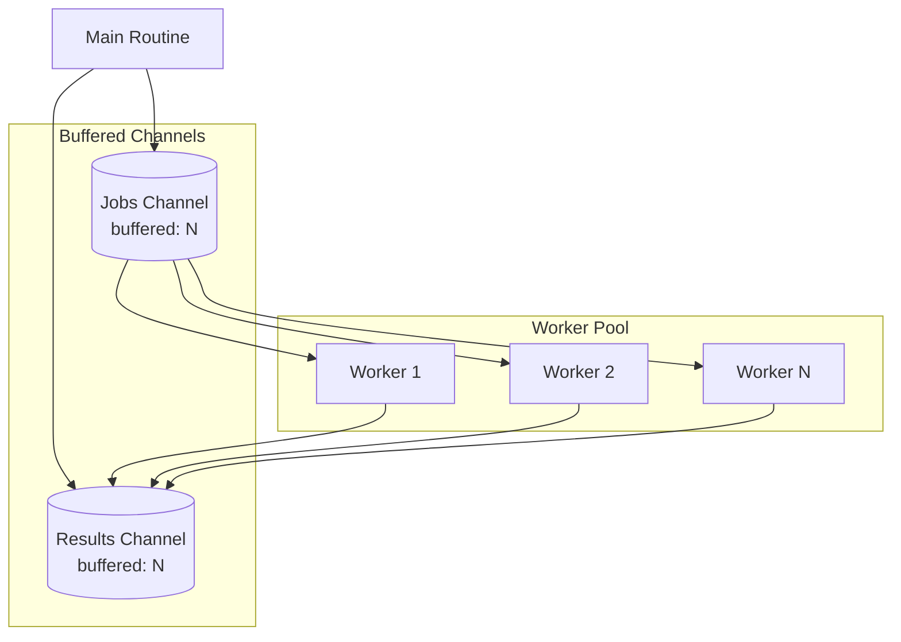

# pdf-extractor Design Document

## 1. Overview

### 1.1 Purpose

pdf-extractor is a command-line utility that extracts delimiter-based values from PDF files using the MuPDF `mutool` binary. The tool processes batches of PDF files concurrently and outputs structured data in JSON or TSV format.

### 1.2 Business Requirements

The application addresses the following business needs:

1. **Document Routing**: Extract routing identifiers from signed DocuSign PDF documents to determine their destination in downstream systems.
2. **Batch Processing**: Process multiple PDF files in a single invocation to support high-volume document workflows.
3. **Integration Compatibility**: Provide machine-readable output formats suitable for consumption by workflow orchestration platforms.
4. **Operational Reliability**: Ensure predictable behavior with explicit exit codes for integration with job schedulers and monitoring systems.

### 1.3 Target Environment

- **Primary Integration**: GoAnywhere MFT (Managed File Transfer) platform
- **Downstream System**: Nuxeo ECM (Enterprise Content Management)
- **Document Source**: DocuSign signed PDF documents
- **Platforms**: Windows Server, Linux (RHEL/CentOS, Ubuntu)

## 2. Use Cases

### 2.1 Primary Use Case: DocuSign Document Routing

**Actors**: GoAnywhere MFT, pdf-extractor, Nuxeo ECM

**Preconditions**:
- Signed PDF files have been deposited in a GoAnywhere workspace directory
- Each PDF contains a routing identifier in the format `DSFN:<value>`
- mutool binary is available on the system

**Flow**:
1. GoAnywhere receives one or more signed PDF files from DocuSign
2. GoAnywhere creates a uniquely-named workspace directory
3. GoAnywhere invokes pdf-extractor with the workspace path and output parameters
4. pdf-extractor extracts routing values from all PDFs and writes results to the output file
5. GoAnywhere parses the output file to determine routing rules for each document
6. Documents are routed to appropriate Nuxeo ECM destinations based on extracted values
7. Workspace directory is destroyed after processing completes

**Postconditions**:
- Output file contains one entry per PDF with filename and extracted value(s)
- Exit code indicates success (0), partial failure (10), or specific error condition (1-5)

### 2.2 Secondary Use Case: Batch Validation

**Purpose**: Validate that a set of PDFs contain expected routing identifiers before processing.

**Flow**:
1. Operator invokes pdf-extractor with `-format tsv` for human-readable output
2. Output is reviewed to identify documents with missing or unexpected values
3. Documents with `null` values are flagged for manual review

### 2.3 Secondary Use Case: Alternative Pattern Extraction

**Purpose**: Extract values using different delimiter patterns for varied document types.

**Flow**:
1. Operator specifies custom `-search` pattern (e.g., `Invoice:`, `PO:`, `REF:`)
2. pdf-extractor extracts values following the specified delimiter
3. Results are processed according to the custom pattern requirements

## 3. Integration Context

### 3.1 System Interfaces



### 3.2 Input Parameters
The command line parameters are parsed to populate the application configuration. See [README.md#4-command-line-interface](README.md#4-command-line-interface) for details on specific CLI flags, optional defaults, and environment variable support.

### 3.3 Expected Inputs

**PDF Files**:
- Standard PDF format (PDF 1.0 through PDF 2.0)
- Text-based content (not scanned images requiring OCR)
- Accessible (not password-protected)
- Contains search pattern on one or more lines

**Search Pattern Format**:
```
<delimiter><optional whitespace><value><end of line>
```

Example patterns in PDF content:
```
DSFN:Employee ID_X_X_X_X_Eag-AHP.pdf
DSFN: 327078_X_X_X_X_Wage.pdf
Invoice: INV-2024-001234
REF:PO-98765
```

### 3.4 Output Formats
The utility supports writing results in standard JSON array, Newline-Delimited JSON (NDJSON), or Tab-Separated Values (TSV). See [README.md#46-output-formats](README.md#46-output-formats) for the exact specification of outputs, field types, and multi-value separation (pipe-delimited values).

## 4. CLI Execution Model
For execution command patterns, CLI flags, Windows PowerShell examples, and Unix shell integration scripts, see the user guide in [README.md#5-usage-examples](README.md#5-usage-examples).

## 5. Concurrency Model

### 5.1 Worker Pool Architecture

The application uses a bounded worker pool pattern for concurrent PDF processing:



### 5.2 Worker Count Bounds

| Condition | Worker Count |
|-----------|--------------|
| Default (workers=0) | runtime.NumCPU() * 2 |
| Below minimum (workers=1) | 2 |
| Within bounds (2-16) | Specified value |
| Above maximum (workers>16) | 16 |

### 5.3 Thread Safety Guarantees

- **Channel-based communication**: All inter-goroutine data transfer uses Go channels
- **No shared mutable state**: Each worker operates on independent file paths
- **Synchronized completion**: sync.WaitGroup ensures all workers complete before result aggregation
- **Buffered channels**: Prevent goroutine blocking during high-throughput processing

## 6. Error Handling

### 6.1 Exit Codes

The application returns detailed, diagnostic exit codes to enable seamless integration and automated error response in workflow orchestration tools (such as GoAnywhere MFT). Each exit code maps directly to a specific failure category (such as path readability, command syntax, or missing dependencies).

For the complete list and detailed descriptions of all exit codes, please refer to the [Exit Codes section of the README.md](README.md#45-exit-codes).

### 6.2 Per-File Error Handling

When mutool fails on a specific file:
1. Error is captured in the Result struct
2. Processing continues for remaining files
3. Output file includes the error entry
4. Exit code 10 (PartialFailure) is returned

### 6.3 Timeout Handling

Each mutool invocation has an independent timeout:
1. Context with deadline is created per file
2. On timeout, process group is terminated
3. Result includes error message "timeout exceeded"
4. Other files continue processing

## 7. Constraints

### 7.1 Technical Constraints

| Constraint | Description |
|------------|-------------|
| **mutool Dependency** | Requires MuPDF mutool binary (version 1.28.0 or compatible) |
| **Text-based PDFs** | Cannot extract from scanned images; requires embedded text |
| **Line-based Matching** | Search pattern must appear on a single line |
| **No OCR** | Does not perform optical character recognition |

### 7.2 Operational Constraints

| Constraint | Description |
|------------|-------------|
| **File Naming** | GoAnywhere ensures unique filenames without special characters |
| **Workspace Lifecycle** | Workspace directories are ephemeral; destroyed after processing |
| **Single Invocation** | Designed for batch processing; not a daemon or service |

### 7.3 Security Constraints

| Constraint | Description |
|------------|-------------|
| **Input Sanitization** | All file paths and environment variables are sanitized |
| **No Network Access** | Application operates entirely on local filesystem |
| **Subprocess Isolation** | mutool runs in separate process group for clean termination |
| **No Credential Storage** | Application does not handle authentication or secrets |

### 7.4 Code Quality Constraints

| Constraint | Description |
|------------|-------------|
| **Portability** | Code must be fully portable across Windows and Linux using build tags for OS-specific code |
| **DRY Principle** | No code duplication; common logic extracted to shared functions |
| **Linting Compliance** | All linter exceptions must be justified with inline comments |
| **Test Coverage** | Minimum 80% code coverage; 100% functional coverage for CLI execution |

## 8. Testing

See [TESTING.md](TESTING.md) for the complete test plan including:

- Unit test specifications
- Integration test requirements
- Coverage requirements and metrics
- Test workspace management
